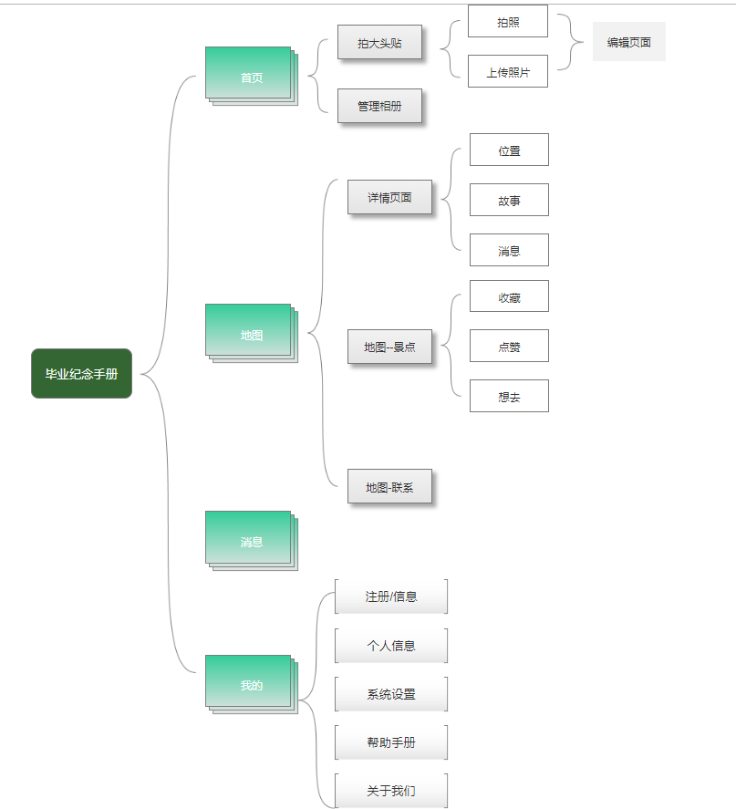
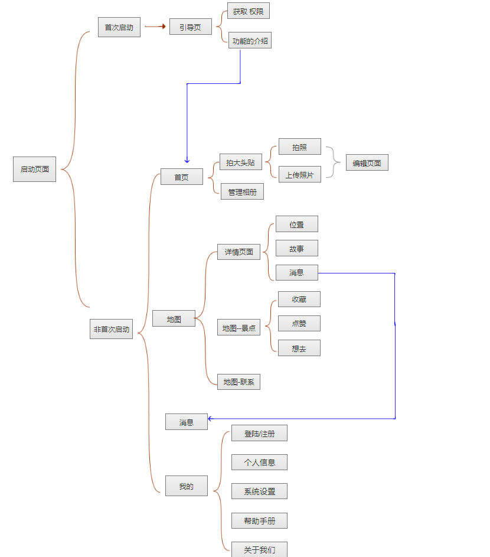

# 毕业纪念手册的需求文档

# 价值主张1（一句话版本）

- 该产品结合地图、地标识别和拍大头贴的API，让即将毕业的朋友随时随地都能排大头贴，并且在毕业后还能知道朋友身处何处，与他们生成一个地域人脉圈。
# 价值主张1（一分钟版本）
- 1、该产品提供了能和朋友随时随地拍大头贴并打印的功能。还能将电子版的保存在该软件中，生成电子相册本。并且提供了结合地图，上传自己所在位置的标志性建筑或景点，进行地标打卡与毕业后的同学们生成一个地域人脉圈，并写下他们的故事，游戏化的让大学人脉资源流动起来。

|产品的PRD设计|原型设计|机器学习之API的输出入展示
|---------- | --- |---------- 
|[PRD1-加值宣言](#chapter1) |[产品功能架构](#chapter14)|[API输入与输出](#chapter18)
|[PRE2-核心价值](#chapter2) |[流程图](#chapter15)|[API1.使用水平](#chapter19)
|[PRD3-用户痛点宣言](#chapter3) |[原型1.交互及界面设计](#chapter17)|[API3.使用后风险报告](#chapter20)
|[产品简介](#chapter4) | [原型2.信息设计](#chapter17)|[API4.加分项](#chapter21)
|[产品背景](#chapter5) |[原型3.原型文档](#chapter17)|[API5.最小完成项目](#chapter22)
|[产品目标](#chapter6) |[Axure交互及设计低保真原型](#chapter17)|---------- 
|[用户画像](#chapter7) |--- |---------- 
|[用户需求](#chapter8) | --- |---------- 
|[情景假设](#chapter9) | --- |----------
|[PRD4-人工智能概率性与用户痛点](#chapter11)| --- |---------- 
|[PRD5-需求列表与人工智能API加值](#chapter12)| --- |---------- 

## 产品的PRD设计

<h3 id="chapter1">一、加值宣言 </h3>

## PRD1-加值宣言

> 百度的地标识别API的价值：
- 借助地标识别api，可以上传自己所在地的景点或者建筑，进行地标打卡，并写下自己的故事。这样不仅能让朋友知道自己现在的状况，还能吸引朋友去当地游玩。生成地域人脉圈的同时，也丰富了旅游足迹，让人脉资源流动起来。

> 腾讯云的大头贴api的价值：
- 可以不用去专门拍大头贴的商店拍照，还要等冲洗的时间。在该系统中，和朋友拍大头贴后，可选择打印的方式。

<h3 id="chapter2">二、PRD2-核心价值（阐述） </h3>

- 该产品提供了能和朋友随时随地拍大头贴并打印的功能。还能将电子版的保存在该软件中，生成电子相册本。
- 该产品提供了结合地图，上传自己所在位置的标志性建筑或景点，进行地标打卡与毕业后的同学们生成一个地域人脉圈，并写下他们的故事，游戏化的让大学人脉资源流动起来。

<h3 id="chapter3">三、PRD3-用户痛点宣言 </h3>

- 有的毕业生想和朋友拍大头贴，要跑到专门的商店或者在一些地方，商店很难找。而且有时候心血来潮想拍大头贴又没办法实现时，难免会失落和扫兴。
- 大头贴的电子版一些商家无法提供，只能洗出照片，这样在携带上十分的不方便。
- 一些人毕业了就很难再联系了，有时候想知道一些朋友现在身处何地，过的如何，但是碍于面子又不敢问或处于其他原因得不到自己想要的信息。有时候在同个地区因为业务要求想找同学探讨却没这个途径，休假时，想约三两老友去游玩却找不到人。

<h3 id="chapter4">四、产品简介 </h3>

###### 本产品旨在为毕业的学生提供一个可以回忆和联系的系统。

- 当学生在毕业的时候，可以随时随地现场拍照或是随时随地上传和朋友的照片，直接生成大头贴并打印；然后可以把图片保留在该系统中，**生成自己的电子相册本**。
- 毕业后，大家虽然各奔东西，但是他们可以通过该系统，结合地图，**上传自己所在位置的标志性建筑或景点等**，并写下自己的故事。大家可以看到其他同学在不同城市的故事，还能**吸引朋友去当地游玩。生成地域人脉圈**的同时，也丰富了旅游足迹，让人脉资源流动起来。

<h3 id="chapter5">五、产品背景</h3>

- 随着智能产品的出现，人们越来越喜欢“便捷式”交往。各种相机快速的记录着毕业生的大学时光，但似乎转眼即逝。今天道别，不知多少年后才能再见；每当想起时，却忘记了自己和他们早已没有了联系。只能凭借着照片来回忆。可是有的人，对于一些同学现在身处何地，过的如何却一概不知。
- “便捷式”的交往，会让大学生产生一种孤独感和抛弃感，更让大学的朋友在时间的考验下生成一种疏离感。

<h3 id="chapter6">六、产品目标</h3>

- 提供直接能随时随地和朋友拍大头贴的功能，并且还能选择打印的方式。
- 将大头贴保留在该软件中，生成电子的纪念相册本。
- 通过上传自己所在位置的标志性建筑或景点，进行地标打卡，可以吸引朋友去当地游玩，并与毕业后的同学们生成一个地域人脉圈，让大学人脉资源流动起来。

<h3 id="chapter7">七、用户画像</h3>

类别 | 详情|
---  |---|
群体 | 大学的毕业生|
年龄 | 23岁之后|
毕业需求 | 1、能和朋友通过拍照的方式记住彼此。2、喜欢和朋友一起照大头贴，搞怪又有趣；3、想要在毕业后也知道一些朋友在哪里，那里有什么景点等

<h3 id="chapter8">八、用户需求 </h3>

- 用户需要一个可以用来拍大头贴的系统们就可以不用专门去跑到商店去，节省时间，又可以随时随地拍。
- 用户想要有个系统，让大家毕业之后岁各奔东西，但还是能看看曾经的同学目前随处的位置，寻找人脉资源的同时，又可以看那边有哪些吸引人的故事和景点。

<h3 id="chapter9">九、情景假设 </h3>

|姓名|身份|详情|
| ---------- | --- |----------- |
|小刘|新闻专业的毕业生|因为自己喜欢拍大头贴，所以想和朋友在毕业时和朋友拍照。但是学校附近没有相关的商店。
|小李|网新专业的毕业生|前不久和朋友出去外面玩的时候兴致勃勃的拍了大头贴，奈何由于自己粗心大意搞丢了，因此自己非常内疚和遗憾。
|小郑|网新已经毕业学生|工作累的时候，自己总会想起大学时期的同学们，想了解他们的近况，但是很多同学早已经不联系了。自己只能默默叹气，感觉自己像被抛弃了一样，十分难过。

<h3 id="chapter11">十一、PRD4-人工智能概率性与用户痛点</h3>

###### 人工智能概率性
- 目前人类对ImageNet图像的识别错误率大约在5%，微软的人工智能系统的错误率为4.94%，谷歌为4.8%。百度在2015年的时候已将这一错误率进一步降至4.58%，实现了质的飞跃。[百度超级计算机图像识别超人类水平 错误率低于微软谷歌](http://tech.ifeng.com/a/20150512/41080218_0.shtml)

###### 用户痛点
- 有的毕业生想和朋友拍大头贴，要跑到专门的商店或者在一些地方，商店很难找。而且有时候心血来潮想拍大头贴又没办法实现时，难免会失落和扫兴。
- 大头贴的电子版一些商家无法提供，只能洗出照片，这样在携带上十分的不方便。
- 一些人毕业了就很难再联系了，有时候想知道一些朋友现在身处何地，过的如何，但是碍于面子又不敢问或处于其他原因得不到自己想要的信息。有时候在同个地区因为业务要求想找同学探讨却没这个途径，休假时，想约三两老友去游玩却找不到人。

<h3 id="chapter12">十二、PRD5-需求列表与人工智能API加值</h3>

|优先级|用户需求|功能实现|api加值|
| ---------- | --------- |----------- |-----------|
|重要|毕业生需要一个能随时随地知道以前的同学在哪里，发生什么故事的软件|故事地图|地标识别API
|次重要|实时定位位置|结合地标识别一起使用|百度地图API
|次重要|随时随地拍大头贴，并自由选择打印的方式|在原型的首页就有拍大头贴功能|大头贴拍照API

## 原型设计

<h3 id="chapter14">一、产品架构图</h3>

<h3 id="chapter15">二、产品流程图</h3>

<h3 id="chapter17">四、Axure原型文档交互展示</h3>

### [原型1.交互及界面设计](http://nfunm104.gitee.io/api_graduation)
### [原型2.信息设计](http://nfunm104.gitee.io/api_graduation)
### 产品原型
### [原型3.原型文档](http://nfunm104.gitee.io/api_graduation)
### [原型下载的地址](https://gitee.com/NFUNM104/API_Graduation)

## API的输出入展示

<h3 id="chapter18">一、API输入与输出</h3>

> 地标识别：
- 将地标识别服务集成到识图APP/小程序中，识别照片中出现的中外著名地标、景点，广泛应用于综合识图场景。
- 可以上传自己所处位置的著名景点或标志性建筑，并写在自己的故事。让大家知道自己身处何处，该处又有哪些诱人的地方。
##### [详细代码示例](https://github.com/zhengxiaopingzxp/API_ML_PM_Graduation/blob/master/%E5%9C%B0%E6%A0%87%E8%AF%86%E5%88%AB.ipynb)

> 腾讯云的大头贴api:
- 给定图片和大头贴编码，对原图进行大头贴特效处理
- 可以随时随地让毕业生和朋友一起拍大头照，而且还可以自由的选择打印的方式。

> 百度地图api：
- 此功能是地标识别的辅助性功能，用户在上传自己所拍的图片时要开百度地图API才能实现实时定位。

<h3 id="chapter19">二、API1.使用水平</h3>

- 输入：现在拍照；输出：大头贴选择
- 输入：本地照片；输出：大头贴选择和编辑
- 输入：故事；输出：详细信息，比如位置、详细说明等

##### [所有代码示例](https://github.com/zhengxiaopingzxp/API_ML_PM_Graduation/blob/master/%E5%9C%B0%E6%A0%87%E8%AF%86%E5%88%AB.ipynb)

<h3 id="chapter20">四、API3.使用后风险报告</h3>

> 百度的地标识别api:
- 有的人所处之地太偏僻，有时候识别不出他（她）的位置。
> 腾讯云的大头贴api：
- 大头贴的样式不是很多，难以满足用户需求。

<h3 id="chapter22">五、API4.加分项</h3>

- 用到的的api有地标识别api、大头贴拍照api、百度地图api
- [所有代码示例](https://github.com/zhengxiaopingzxp/API_ML_PM_Graduation/blob/master/%E5%9C%B0%E6%A0%87%E8%AF%86%E5%88%AB.ipynb)

<h3 id="chapter22">五、API5.最小完成项目</h3>

- 地标识别：

